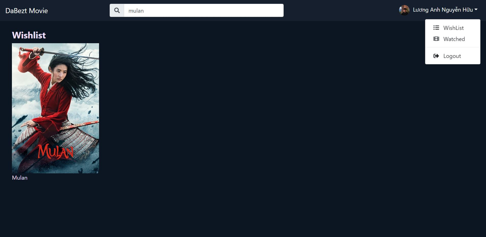

# DaBezt Movie App

## About

> A movie website allows user to view latest, popular movies as well as view detail information like title, vote average, trailers, actors. User also can add movie to wishlist and watchedlist.

## Technology

-   ReactJS
-   React Hooks - Context API
-   Formik
-   Reactrap
-   Firebase Auth
-   TMDB API

## Features

-   Sign in/ Sign up with Email, Google, Facebook
-   Search Movie
-   Pagination
-   View Detail Movie (title, introduction, trailers, actors, recomendations)
-   Add to wishlist/ watchedlist

## API

-   Using TDMB API for getting data
-   Link: https://developers.themoviedb.org/3

## Screenshot

